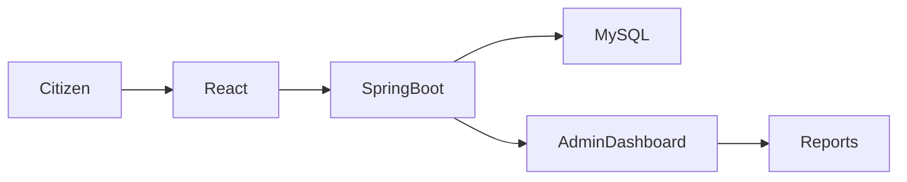

<!-- Premium README -->

<div align="center">

# 💧 Water Quality Monitoring (WQM)

### AI-Powered Smart Water Complaint Management System


**Complaint Management • Water Monitoring • SDG 6 • Smart Governance**

</div>

---

# 🌊 Overview

Water Quality Monitoring (WQM) is a full-stack web platform that enables citizens to report water-related issues such as leakage, contamination, supply interruptions, and sanitation concerns. Administrators can efficiently monitor complaints, manage resolutions, and visualize insights through an interactive dashboard.

---

# 🎯 Objectives

- Improve complaint management efficiency.
- Support clean and safe drinking water initiatives.
- Provide transparent issue tracking.
- Enable data-driven administrative decisions.

---

# 🌍 SDG 6 Alignment

The platform supports **United Nations Sustainable Development Goal 6** by promoting access to clean water through faster complaint reporting and resolution.

---

# ✨ Features

| Feature | Description | Status |
|---------|-------------|--------|
| 💧 Complaint Submission | Citizens can report water issues | ✅ |
| 🔐 Authentication | Secure login system | ✅ |
| 📊 Admin Dashboard | Complaint analytics | ✅ |
| 📍 Complaint Tracking | Track complaint status | ✅ |
| 📈 Charts & Reports | Data visualization | ✅ |
| 📱 Responsive UI | Mobile-friendly interface | ✅ |

---

# 🛠 Tech Stack

## Frontend
- React.js
- Axios
- Chart.js
- Font Awesome

## Backend
- Spring Boot
- Spring Web
- Spring Data JPA

## Database
- MySQL

---

# 📂 Project Structure

```text
Water-Quality-Monitoring/
│
├── frontend/
│   ├── src/
│   ├── components/
│   ├── pages/
│   └── assets/
│
├── backend/
│   ├── controller/
│   ├── service/
│   ├── repository/
│   ├── entity/
│   └── config/
│
├── database/
└── README.md
```

---

# 🏗️ System Architecture



---

# 🚀 Installation

```bash
git clone https://github.com/yourusername/Water-Quality-Monitoring.git
cd Water-Quality-Monitoring
```

## Backend

```bash
cd backend
mvn spring-boot:run
```

## Frontend

```bash
cd frontend
npm install
npm start
```

---

# ⚙️ Environment Variables

```env
MYSQL_URL=
MYSQL_USERNAME=
MYSQL_PASSWORD=
SERVER_PORT=
JWT_SECRET=
```

---

# 📋 Functional Modules

## Citizen Portal
- Register complaints
- Upload details
- Track status

## Admin Portal
- Manage complaints
- Assign priorities
- Generate reports

## Dashboard
- Complaint analytics
- Charts
- Statistics

---

# 🗄️ Database

### Users
- id
- name
- email
- role

### Complaints
- id
- title
- description
- location
- status

### Admin
- id
- username
- password

---

# 📸 Screenshots

Add screenshots here:

- Home Page
- Complaint Form
- Admin Dashboard
- Analytics

---

# 🚀 Future Scope

- AI Complaint Classification
- GIS Map Integration
- Mobile Application
- SMS & Email Notifications
- IoT Water Sensor Integration
- Predictive Analytics

---

# 🤝 Contributing

```bash
git checkout -b feature/new-feature
git commit -m "Add new feature"
git push origin feature/new-feature
```

Create a Pull Request.

---

# 📜 License

MIT License

---

# 👨‍💻 Author

**Umang Pandey**

- GitHub: https://github.com/Umangpandey75
- LinkedIn: https://linkedin.com/in/umang-pandey-01b486273
- Portfolio: https://umangpandey.vercel.app

---

# ⭐ Support

If you found this project useful, give it a ⭐ on GitHub.

Made with ❤️ by **Umang Pandey**
